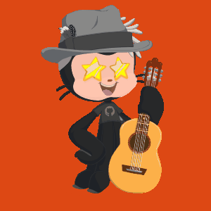

### Hi there, I'm Thomas! 👋

- 🔭 I’m currently working on [Mon Pro Web](https://monproweb.io)
- 🌱 I’m currently learning Artificial intelligence
- 👯 I’m looking to collaborate on [Ethereum](https://ethereum.org/fr/contributing/translation-program/contributors/) [React](https://opencollective.com/create-react-app) [Ubuntu](https://launchpad.net/~thomaserhel)
- 📫 How to reach me:  `thomas.erhel@gmail.com`
- 👨‍🎓 Achievements: FreecodeCamp(FullStack Developer) 🕊, OpenclassRooms (Software development expert) 👨‍💻, Google (Automation with Python) 🐍, London App Brewery (Flutter development bootcamp with Dart) 🐦, I took CS50 🐥, Meta Front-End Developer ⚛️
- ❤️‍🔥 WWF, Wikipedia, TED
- 🎧 Music: [lofi hip hop radio - beats to relax/study to](https://youtu.be/jfKfPfyJRdk)
- ⚡ Fun fact: React is not a framework

#ZeroKnowledge
#PracticeMakesPerfect
#NeverGiveUp
#FreeUkraine
#BlackLivesMatter

